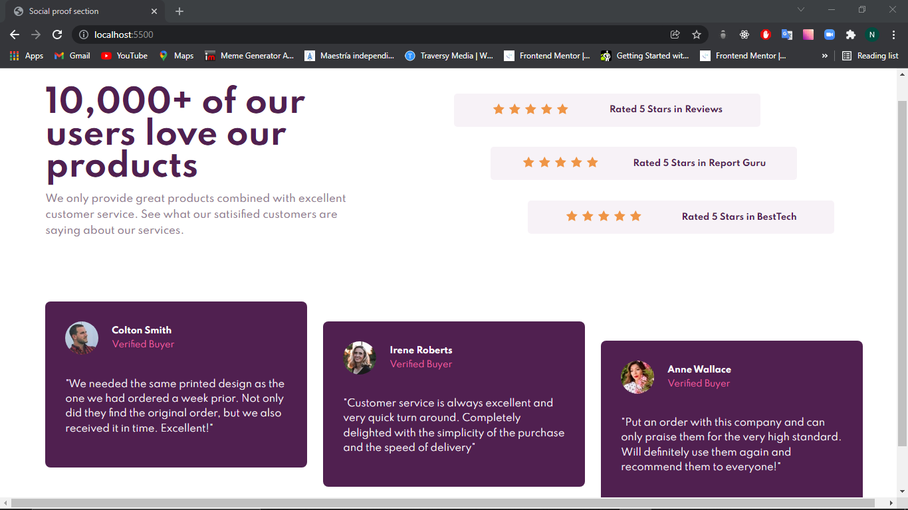
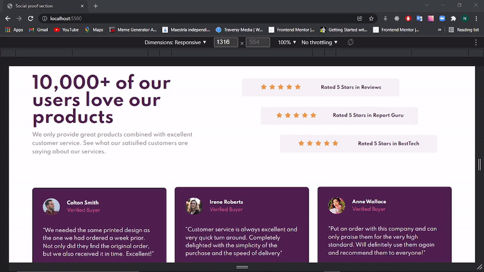

# Social proof section 

Solucion a [Social proof section challenge on Frontend Mentor](https://www.frontendmentor.io/challenges/social-proof-section-6e0qTv_bA).  

## Contenido

- [Social proof section](#social-proof-section)
  - [Contenido](#contenido)
  - [INFORMACION GENERAL](#informacion-general)
    - [DESAFIO](#desafio)
    - [Screenshot](#screenshot)
    - [Links](#links)
    - [Echo con](#echo-con)
    - [Recursos utiles](#recursos-utiles)
  - [Autor](#autor)

## INFORMACION GENERAL

### DESAFIO

Los usuarios deben ser capaces de:

- Ver el diseño óptimo según el tamaño de pantalla de su dispositivo

### Screenshot

### Links

- Solucion URL: [Add solution URL here](https://your-solution-url.com)
- Sitio URL: [Add live site URL here](https://your-live-site-url.com)

### Echo con

- Semantic HTML5 markup
- CSS , SASS
- Flexbox
- Mobile-first workflow

### Recursos utiles

- [WesBos Flexbox](https://courses.wesbos.com/account/access/61f1a801f38d7b6990eeb86d/view/195969522) 
- [CSS Tricks](https://css-tricks.com/snippets/css/a-guide-to-flexbox/) 

## Autor

- Website - [Nicolas Gula](https://www.your-site.com)

